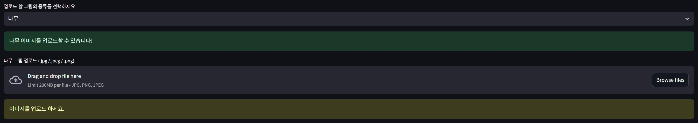
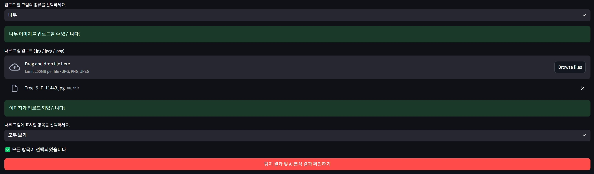

# 아동 심리 검사(HTP) AI 분석 페이지

본 프로젝트는 **딥러닝**을 활용하여 **아동 심리 검사(HTP 검사)** 데이터를 분석하고, 사용자 인터랙션을 지원하는 **Streamlit 기반 웹 페이지**를 구축하는 것을 목표로 하였습니다.

- 데이터 출처: [AI Hub - 아동화 이미지 데이터](https://www.aihub.or.kr/aihubdata/data/view.do?currMenu=115&topMenu=100&dataSetSn=71399)
- 주요 기술 스택: `YOLOv11n`, `Streamlit`, `Python`, `Gemini API`

---

## 데이터 구성 및 전처리

AI Hub에서 제공된 데이터는 **Training**, **Validation** 데이터셋만 존재하며, **Test 데이터셋은 제공되지 않습니다**.  
각 데이터셋은 다음과 같은 테마별로 분리되어 있습니다.

- 나무 (Tree)  
- 남자사람 (Boy)  
- 여자사람 (Girl)  
- 집 (House)  

디렉토리 구조는 다음과 같습니다.

- 01.원천데이터 (jpg 이미지 파일)  
- 02.라벨링데이터 (json 파일)  

라벨링 데이터에는 다음과 같은 정보가 포함되어 있습니다.

- **메타데이터**: 이미지 ID, 생성일자, 파일 경로, 해상도, 수검자의 나이와 성별  
- **Annotations**:  
  - 그림 종류 (나무, 사람, 집 등)  
  - 각 개체별 Bounding Box 좌표  
  - 전체 이미지 대비 크기 비율 및 메인 개체 대비 크기 비율  
  - 개체 수 정보  

### 데이터 전처리

디렉토리 구조를 다음과 같이 재구성했습니다.

- 테마 (나무/남자사람/여자사람/집)  
  └── train / valid / test  
　　└── images / jsons / labels  

- 수검자의 **나이와 성별**을 고려하여 데이터 분포를 고르게 맞춰 **테스트셋**을 별도로 분리했습니다.  
- JSON 라벨링 파일을 파싱하여 **YOLO 포맷(label.txt)**으로 변환했습니다.  
  - Bounding Box 좌표를 이미지 크기에 맞게 정규화  
  - YOLO 형식(class_id, x_center, y_center, width, height)으로 변환  

---

## 모델 학습

각 테마별로 **YOLOv11n** 모델을 사용하여 개체 탐지 학습을 진행했습니다.  
탐지 대상은 테마별 주요 개체입니다.

- 예시:  
  - 나무 (전체, 기둥, 가지 등)  
  - 사람 (전체, 얼굴, 손 등)  
  - 집 (전체, 지붕 등)  

---

## 서비스 페이지 구현

**Streamlit**을 이용해 웹 기반 페이지를 제작하여 사용자가 쉽고 직관적으로 검사 결과를 확인할 수 있도록 하였습니다.

### 주요 기능

1. 테마 선택 (나무, 남자사람, 여자사람, 집 중 하나 선택)

2. 선택한 테마에 맞는 이미지 업로드

3. 개체 선택 (모두 선택 또는 일부 선택 가능)

4. 선택한 개체만 이미지에 Bounding Box로 표시
  - 모두 보기

  - 선택 보기

5. 탐지된 개체별 **룰 기반 평가** 결과를 화면 우측에 출력
6. **"종합 평가" 버튼 클릭 시**, Gemini API를 호출하여 전체적인 심리 평가 문장을 생성  

### 특징

- 사용자가 선택한 개체에 따라 유연하게 결과가 출력됩니다.  
- 개별 개체에 대한 심리 해석 + AI 기반 종합 심리 평가를 제공합니다.  
- 직관적이고 간결한 UI/UX를 설계하였습니다.  

---

## 기술 스택

| 분야 | 사용 기술 |
|:-----|:---------|
| 딥러닝 모델 | YOLOv11n |
| 웹 프레임워크 | Streamlit |
| 데이터 처리 | Python (Pandas, JSON) |
| AI 평가 문장 생성 | Gemini API |
