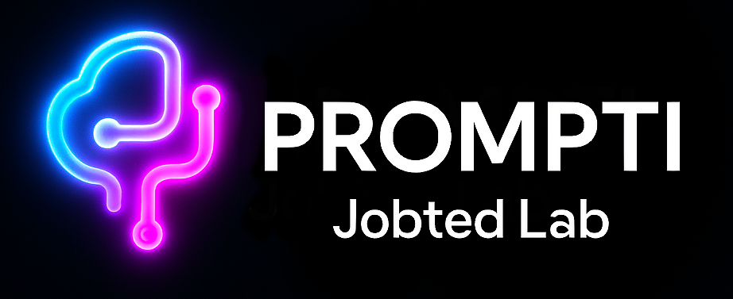

# LLM 기반 구인·구직 AI 에이전트

본 프로젝트는 OpenAI API를 기반으로 한 구인·구직 AI 에이전트로, **기업 회원**과 **개인 회원**에게 맞춤형 채용 및 면접 기능을 제공합니다.

---

## 주요 기능

### 기업 회원용
- 채용 포지션과 요구 경력 입력 시, LangChain Prompt와 RAG 시스템을 통해 **직무 기술서(JD)** 자동 생성
- JD에는 **주요 업무**, **자격 요건**, **우대 사항** 포함
- 생성된 JD는 **수정, 복사, .txt 다운로드** 가능
- JD 기반으로 **면접 질문 리스트(기본 10개)** 자동 생성

### 개인 회원용
- 관심 포지션과 연차(경력)를 입력하면, Chroma DB에서 사전 정의된 **면접 질문**을 가져와 **채팅형 시뮬레이션 면접** 제공
- 각 답변에 따라 **꼬리 질문** 1개 자동 생성
- 면접 종료 후 **직무 이해도**, **기술 활용 능력**, **문제 해결 능력**, **종합 평가**에 대한 **AI 피드백 및 모범 답변** 제공
- **면접 기록 조회 기능**을 통해 과거 면접 질문, 응답, 피드백, 모범 답변 확인 가능

---

## 데이터 수집 및 전처리

### 직무 기술서 수집
- Selenium + BeautifulSoup을 사용해 구인구직 플랫폼에서 특정 키워드(데이터, AI, 머신러닝, 인공지능 등) 기반 공고 크롤링
- 공고 제목 기반 **포지션 태깅 작업** 수행
- 상세 페이지에서 **주요 업무, 자격 요건, 우대 사항** 추출 후 임베딩하여 Chroma DB에 저장

### 예상 면접 질문 수집
- LangChain Prompt를 통해 포지션 및 경력 기반 질문 수집
- 수집된 질문을 임베딩 후 Chroma DB에 적재

---

## 추가 고려 사항

- 프로젝트 초기에 **OpenAI의 Embedding 모델**을 사용했으나, **토큰 비용 절감을 위해 KoSimCSE(Hugging Face)** 모델로 교체하여 운영비용을 최적화함

---

## 기술 스택
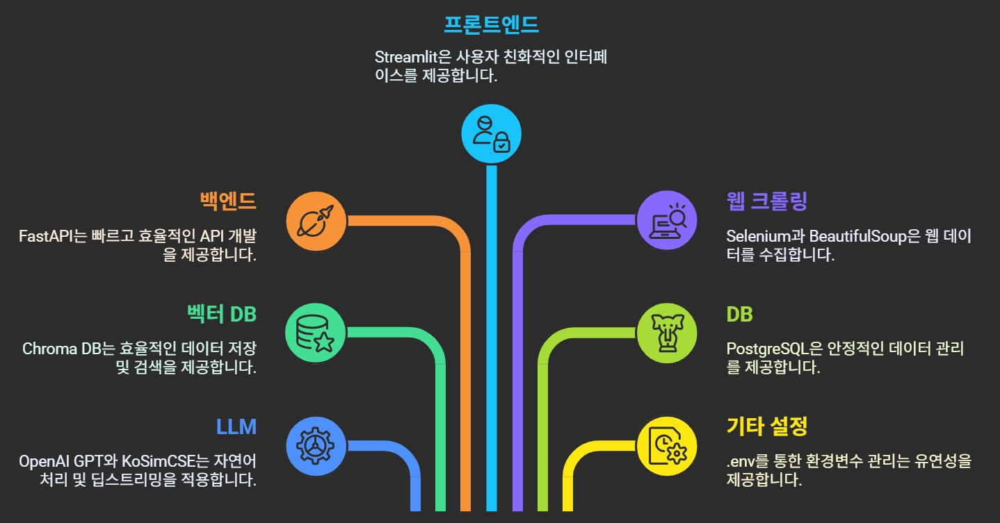

| 분류           | 기술 상세                           |
|----------------|-------------------------------------|
| LLM            | OpenAI GPT, KoSimCSE (Hugging Face) |
| 벡터 DB        | Chroma DB                           |
| 백엔드         | FastAPI                             |
| 프론트엔드     | Streamlit                           |
| 웹 크롤링      | Selenium, BeautifulSoup             |
| DB             | PostgreSQL                          |
| 기타 설정      | .env를 통한 환경변수 관리           |

---

## 서비스 흐름 요약

### 기업 회원 흐름
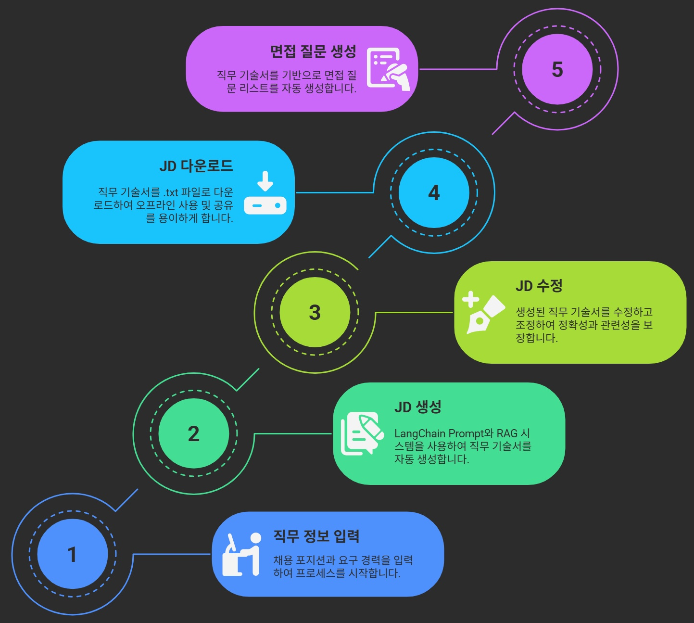

1. 포지션, 경력 입력
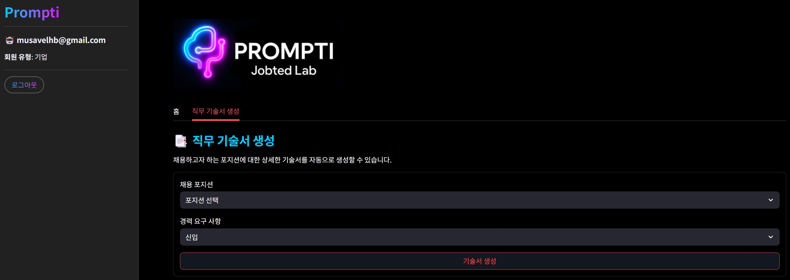
2. LangChain Prompt + ChromaDB를 활용한 JD 자동 생성
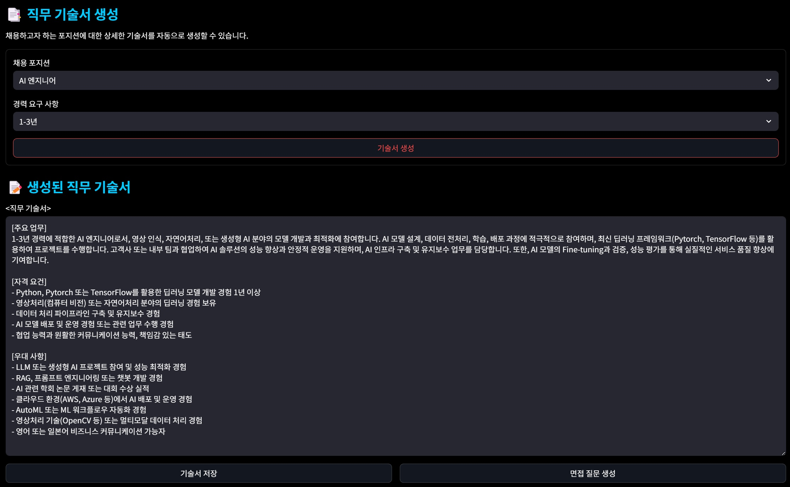
3. JD 확인 및 수정, 저장
4. 면접 질문 자동 생성 (기본 10개)
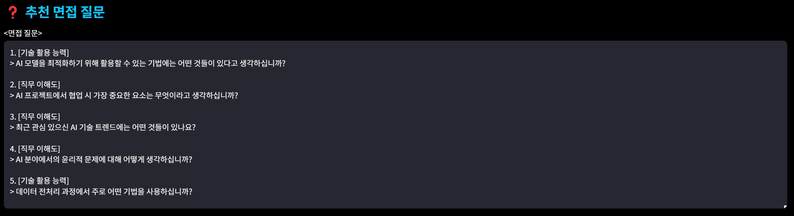

---

### 개인 회원 흐름
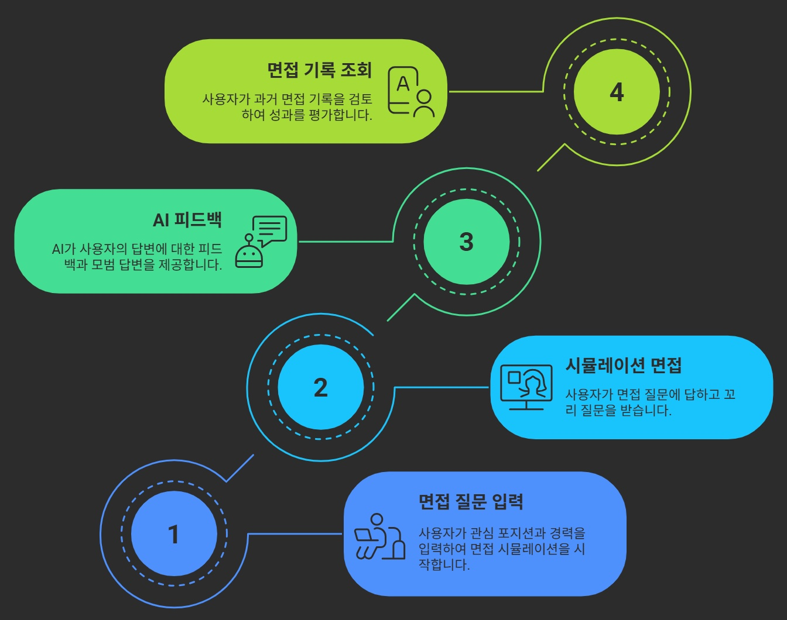

1. 포지션, 연차 입력
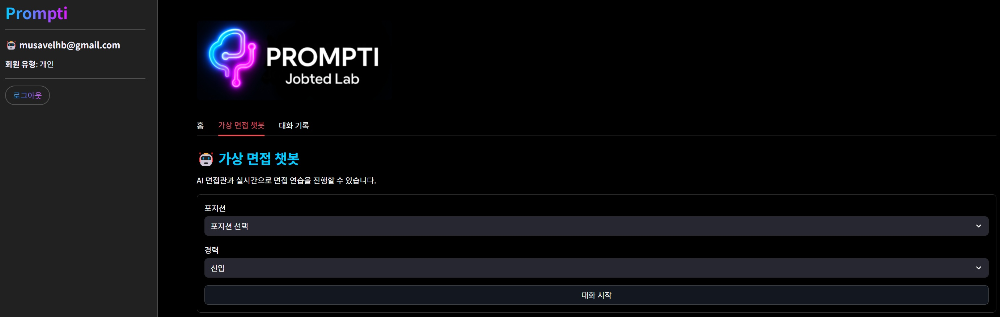
2. 사전 정의된 질문 + 꼬리 질문을 통한 채팅형 면접 시뮬레이션
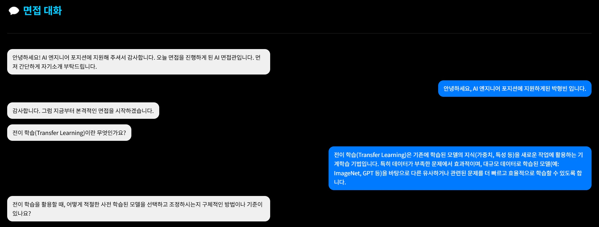
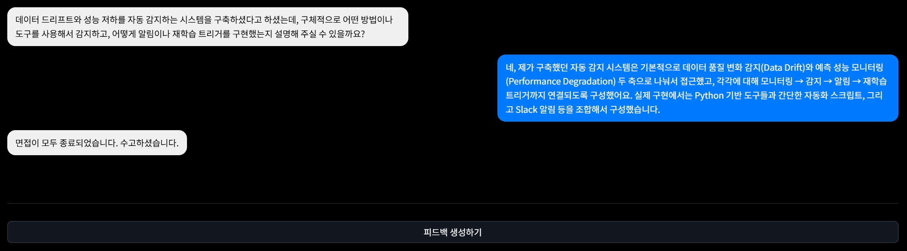
3. 면접 종료 후 피드백 + 모범 답변 제공
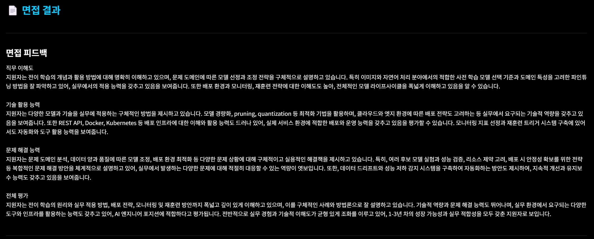
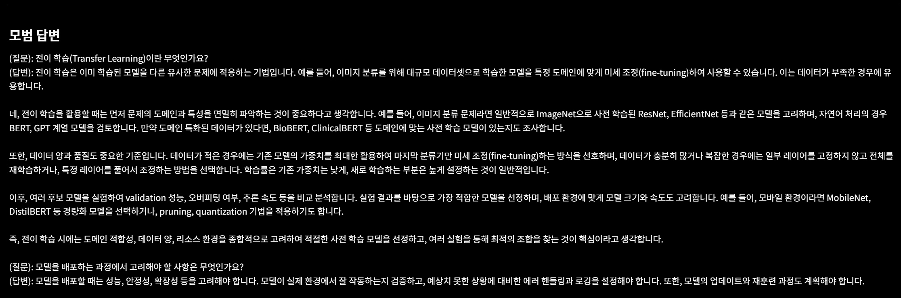
4. 면접 기록 확인 가능 (가장 최근 기록부터 조회 가능)
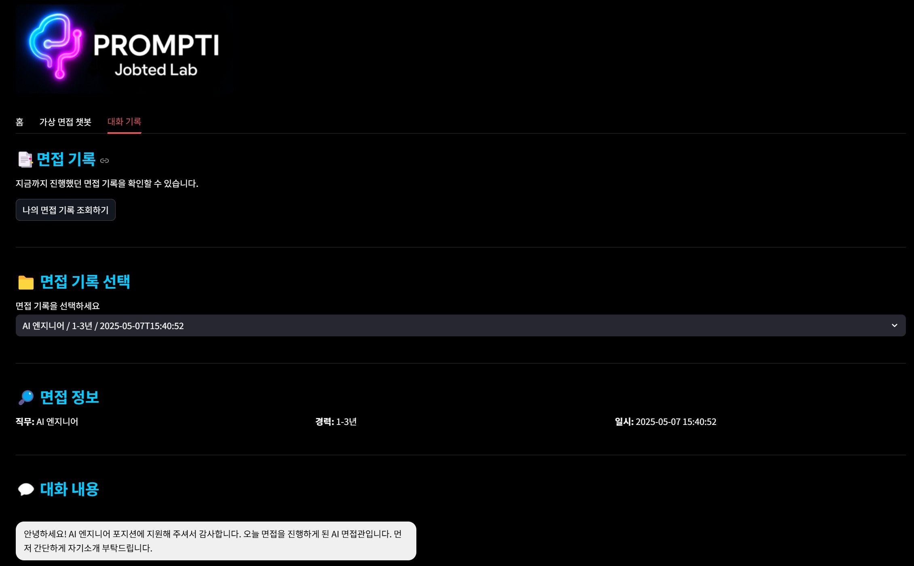

---

## 프로젝트 한계점

- JD 및 질문/피드백 생성 등 여전히 **OpenAI API에 대한 의존** 존재
- **동일 포지션-다른 경력** 간 질문 다양성이 부족
- 경력자의 경우 **이력서 기반 면접 질문 자동화 기능**이 없다는 점이 아쉬움으로 남음
- **직무명은 같아도 도메인(예: 게임, 헬스케어, 제조 등)에 따라 요구되는 기술이 상이**함에도 불구하고, 현재 시스템은 이러한 **도메인별 기술 스택 차이**를 반영하지 못함
  - 예: AI 엔지니어라도 게임 도메인에서는 강화학습, 실시간 추론 성능이 중요할 수 있고, 헬스케어에서는 의료 데이터 처리나 규제 대응 역량이 더 중요할 수 있음
- 이처럼 **포지션명 중심의 일관된 질문 생성 방식**은 실제 업무 현장의 요구와의 정합성이 떨어질 수 있음
- 향후에는 **도메인 정보를 입력받거나 자동 추출**하여, **도메인 특화 질문 생성 및 피드백 제공**이 가능하도록 확장할 필요가 있음

---

## 마무리

본 프로젝트는 LLM 기반의 RAG 시스템을 활용하여, 채용/면접 과정의 자동화 및 효율화를 목표로 하였습니다. 실제 채용 시장에서 활용 가능한 기능들을 실험적으로 구현하였으며, 지속적인 개선 가능성을 바탕으로 서비스 품질을 고도화할 수 있습니다.
