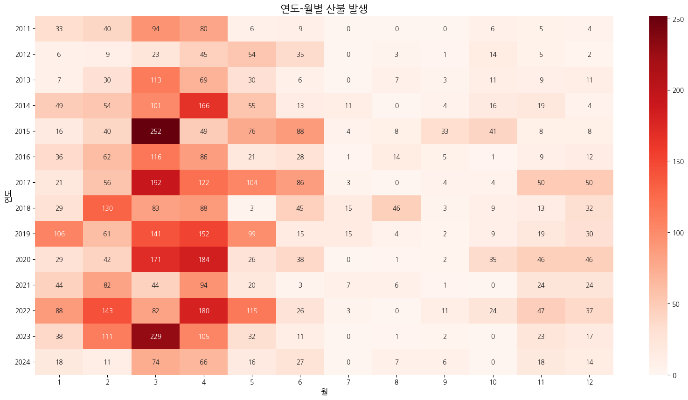
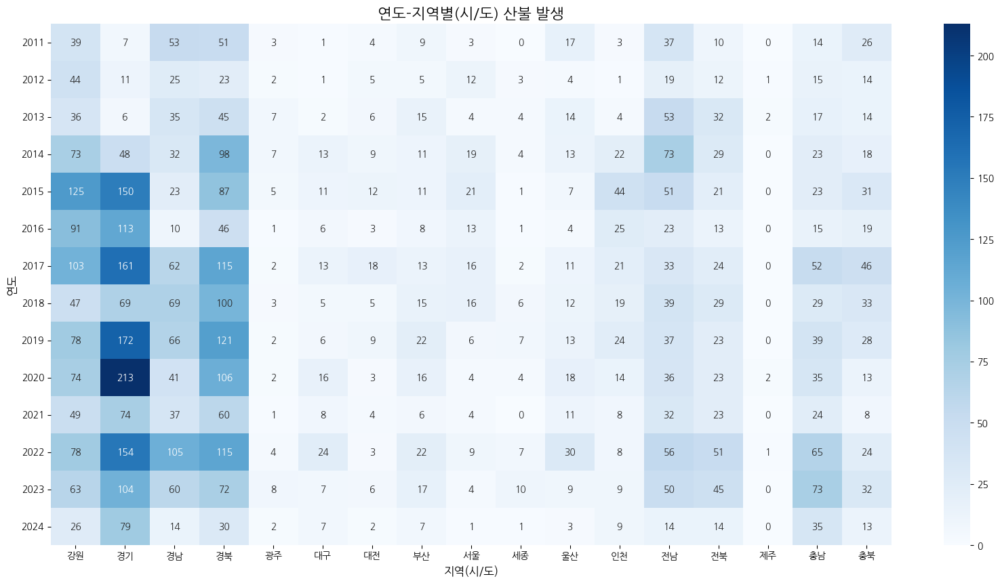
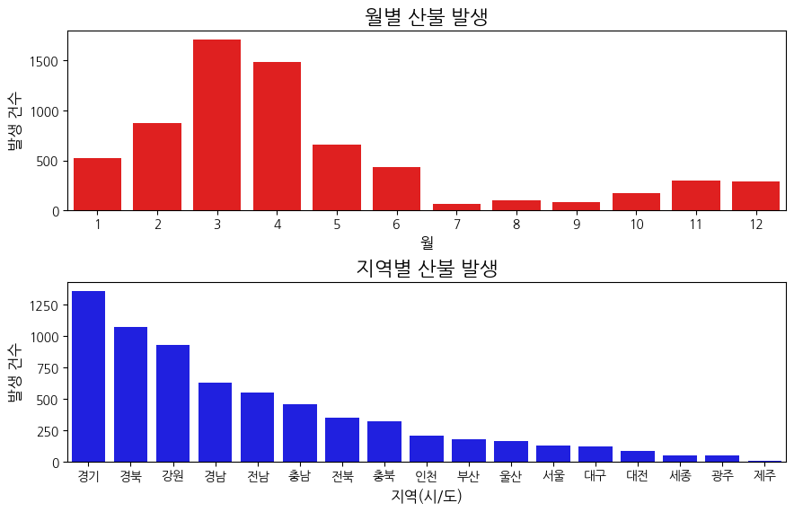
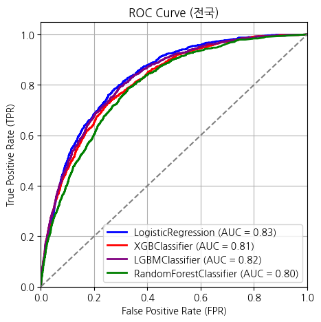
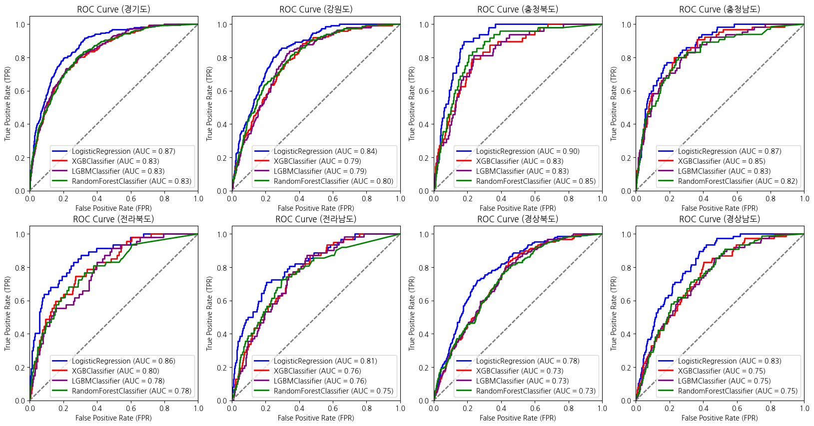
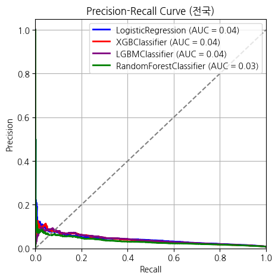
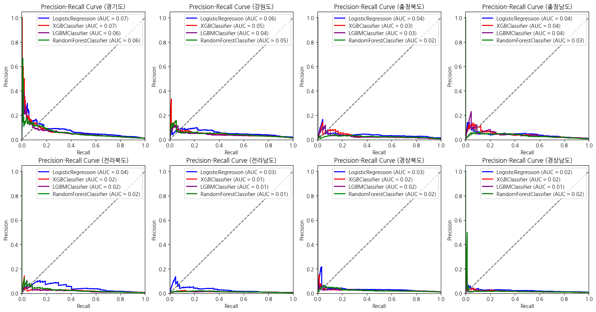

# 산불 발생 예측 머신러닝 프로젝트

## 프로젝트 개요

본 프로젝트는 전국 산불 발생 데이터를 기반으로 머신러닝 기법을 활용하여 산불 발생 여부를 예측하기 위한 모델을 개발하는 것을 목표로 하였습니다. 데이터 수집부터 전처리, 시각화, 모델 학습 및 평가까지 전 과정을 수행하였습니다.

---

## 데이터 수집

다양한 소스에서 산불 발생에 영향을 줄 수 있는 데이터를 수집하였습니다.

| 데이터명 | 출처 | 설명 |
|-----------|------|------|
| 산불 발생 데이터 | [공공데이터포털](https://www.data.go.kr/data/3070842/openapi.do#) | 실제 산불 발생 건수 및 시기 정보 |
| 전국 행정구역 위도·경도 | [블로그](https://herjh0405.tistory.com/156#google_vignette) | 시군구 단위 위도, 경도 정보 |
| 날씨 데이터 | [기상청 API 허브](https://apihub.kma.go.kr/) | 기온, 강수량, 풍속, 습도 등 일별 기상 정보 |
| 토지 면적 데이터 | [KOSIS 통계청](https://kosis.kr/statHtml/statHtml.do?...) | 행정구역별 토지 이용 현황 (전, 답, 묘지 등) |
| 인구 데이터 | [행정안전부](https://jumin.mois.go.kr/) | 행정동별 주민등록 인구 및 세대 수 |

참고 문헌: [산불발생 예측을 위한 기계학습 기법 비교](https://www.j-kosham.or.kr/upload/pdf/KOSHAM-2023-23-2-29.pdf)

---

## 데이터 분석 및 시각화

데이터 전처리에 앞서, 과거 산불 발생 데이터를 중심으로 시각화 작업을 수행하여 산불이 발생하는 시간적, 공간적 패턴을 파악하고자 하였습니다. 

먼저 연도 및 월별로 산불 발생 빈도를 집계하여 시기별 추이를 확인하였고, 이를 Heatmap으로 시각화하여 특정 월이나 계절에 집중적으로 산불이 발생하는 경향이 있는지를 파악했습니다.

또한 지역별 산불 발생 현황을 살펴보기 위해 시/도 단위로 데이터를 집계하고, 이를 연도별로 나누어 Heatmap으로 표현하였습니다. 이를 통해 특정 지역에서 산불 발생 빈도가 높은지 여부를 확인할 수 있었습니다.

추가적으로, 전체 수집 기간 동안의 월별 산불 발생 건수와 지역별 발생 건수를 각각 Bar Plot으로 시각화하여 산불이 자주 발생하는 시기와 지역을 직관적으로 파악할 수 있도록 하였습니다.

---

## 데이터 전처리

- **통합 단위**: 날짜, 시/군/구 단위
- **데이터 병합**: 날씨, 토지 면적, 인구 데이터와 병합
- **관측소 연결**: 지역 위경도를 기반으로 가장 가까운 기상 관측소와 날씨 데이터 연결

### 결측치 처리 기준

| 변수명 | 대체 기준 |
|--------|-----------|
| `rain` | 0 |
| `total_area`, `field_area`, `paddy_area`, `cemetery_area` | 동일 지역 전년도 값 |
| `tempAvg`, `tempMin`, `tempMax` | 동일 지역 같은 달 평균 |
| `humMin`, `humAvg` | 동일 지역 같은 달 평균 |
| `windMax`, `windAvg` | 동일 지역 같은 달 평균 |

---

## 클래스 불균형 처리

실제 산불 발생 비율이 매우 낮기 때문에, `SMOTE`를 활용하여 오버샘플링을 적용했습니다.

---

## 모델 학습

`GridSearchCV`를 활용하여 하이퍼파라미터 튜닝과 함께 다음의 4가지 분류 모델을 학습하였습니다.

### 1. LogisticRegression
- **C**: 규제 강도를 조절하는 하이퍼파라미터 (작을수록 규제 강함)
  - 값: `[0.01, 0.1, 1, 10, 100]`

### 2. RandomForestClassifier
- **n_estimators**: 생성할 트리의 수  
  - 값: `[100, 300, 500]`
- **max_depth**: 트리의 최대 깊이  
  - 값: `[None, 10, 20, 30]`
- **min_samples_leaf**: 리프 노드에 있어야 할 최소 샘플 수  
  - 값: `[2, 5, 10]`  
    - `'n_estimators'`: `[100, 300, 500]`  
    - `'max_depth'`: `[None, 10, 20, 30]`  
    - `'min_samples_leaf'`: `[2, 5, 10]`

### 3. XGBClassifier
- **n_estimators**: 부스팅 반복 횟수  
  - 값: `[100, 300, 500]`
- **num_leaves**: 리프 노드 수  
  - 값: `[31, 63, 127]`
- **learning_rate**: 학습률  
  - 값: `[0.01, 0.1, 0.2]`  
    - `'n_estimators'`: `[100, 300, 500]`  
    - `'num_leaves'`: `[31, 63, 127]`  
    - `'learning_rate'`: `[0.01, 0.1, 0.2]`

### 4. LGBMClassifier
- **n_estimators**: 부스팅 반복 횟수  
  - 값: `[100, 300, 500]`
- **max_depth**: 최대 트리 깊이  
  - 값: `[None, 10, 20, 30]`
- **min_samples_leaf**: 리프 노드에 있어야 할 최소 샘플 수  
  - 값: `[2, 5, 10]`  
    - `'n_estimators'`: `[100, 300, 500]`  
    - `'max_depth'`: `[None, 10, 20, 30]`  
    - `'min_samples_leaf'`: `[2, 5, 10]`

---

## 모델 평가 결과

### 전체 정확도 및 ROC-AUC

| 모델 | Accuracy | ROC-AUC |
|------|----------|---------|
| LogisticRegression | 0.72 | 0.83 |
| RandomForestClassifier | 0.99 | 0.80 |
| XGBClassifier | 0.99 | 0.81 |
| LGBMClassifier | 0.99 | 0.82 |

 

### 정밀도, 재현율, PR-AUC

| 모델 | Precision | Recall | PR-AUC |
|------|-----------|--------|--------|
| LogisticRegression | 0.02 | 0.78 | 0.04 |
| RandomForestClassifier | 0.08 | 0.03 | 0.03 |
| XGBClassifier | 0.11 | 0.01 | 0.04 |
| LGBMClassifier | 0.03 | 0.002 | 0.04 |

 

> 정확도는 높지만 정밀도와 재현율이 매우 낮은 것을 확인할 수 있었습니다. 이는 **심각한 클래스 불균형**과 관련이 있습니다.

---

## 프로젝트 수행 중 겪은 문제 및 한계점

프로젝트를 수행하면서 여러 어려움을 경험했습니다. 먼저, 산불 발생 자체가 드물기 때문에 대부분의 모델이 "산불 없음"으로 예측하여 정확도는 높지만 실제 발생한 산불을 제대로 탐지하지 못하는 문제가 있었습니다. 

또한, 서로 다른 출처에서 수집한 데이터를 병합하는 과정에서도 많은 어려움이 있었습니다. 지역명이 데이터마다 표기 방식이 달라 같은 지역임에도 불구하고 정확하게 병합되지 않는 경우가 발생했고, 이를 해결하기 위해 다양한 문자열 정제 및 일치화 작업이 필요했습니다.

날씨 데이터의 경우, 지역별로 기상관측소 데이터가 존재하지 않아 행정구역 중심 좌표를 기준으로 가장 가까운 관측소의 데이터를 연결했는데, 이로 인해 실제 산불 발생 지점의 날씨와 일치하지 않는 경우가 발생할 수 있다는 한계가 있었습니다. 이런 점은 예측 정확도에 부정적인 영향을 줄 수 있었습니다.

## 해결 및 개선 방향

1. **더 다양한 오버샘플링 기법** 적용 (예: SMOTE-ENN, ADASYN)
2. **언더샘플링과 오버샘플링 병행**하여 데이터 균형 재조정
3. **스태킹 기법 활용**: 여러 모델(Logistic Regression, XGBoost, LightGBM 등)의 예측 결과를 메타 모델에 결합하여 예측 성능 향상

---

